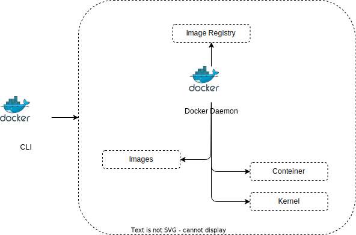

# Módulo Docker - FC

---

## Diagrama:

---

## Flags importantes do Docker:
1. **`-d` ou `--detach`**: Executa o contêiner em segundo plano.
   - Exemplo: `docker run -d nome_do_contêiner`

2. **`-p` ou `--publish`**: Publica uma porta do contêiner para o host.
   - Exemplo: `docker run -p porta_host:porta_contêiner nome_do_contêiner`

3. **`-v` ou `--volume`**: Monta um volume.
   - Exemplo: `docker run -v caminho_host:destino_contêiner nome_do_contêiner`

4. **`-e` ou `--env`**: Define variáveis de ambiente.
   - Exemplo: `docker run -e "NOME_VARIAVEL=valor" nome_do_contêiner`

5. **`-it`**: Inicia um contêiner interativo com um terminal.
   - Exemplo: `docker run -it nome_do_contêiner /bin/bash`

6. **`--rm`**: Remove automaticamente o contêiner após a sua execução.
   - Exemplo: `docker run --rm nome_do_contêiner`

7. **`--name`**: Atribui um nome ao contêiner.
   - Exemplo: `docker run --name nome_personalizado nome_do_contêiner`

8. **`--network`**: Conecta o contêiner a uma rede específica.
   - Exemplo: `docker run --network nome_rede nome_do_contêiner`

---

## Dockerfile:

### Criando no docker hub a imagem:
`docker build -t douglasmorais/nginx-vim:latest .`

### Para conferir a imagem:
`docker image`

### Acessando a imagem com terminal usando o vim:
`docker run it douglasmorais/nginx-vim bash`

---

## Docker compose:

---

## Como rodar localmente:

---

### Por: Douglas Morais